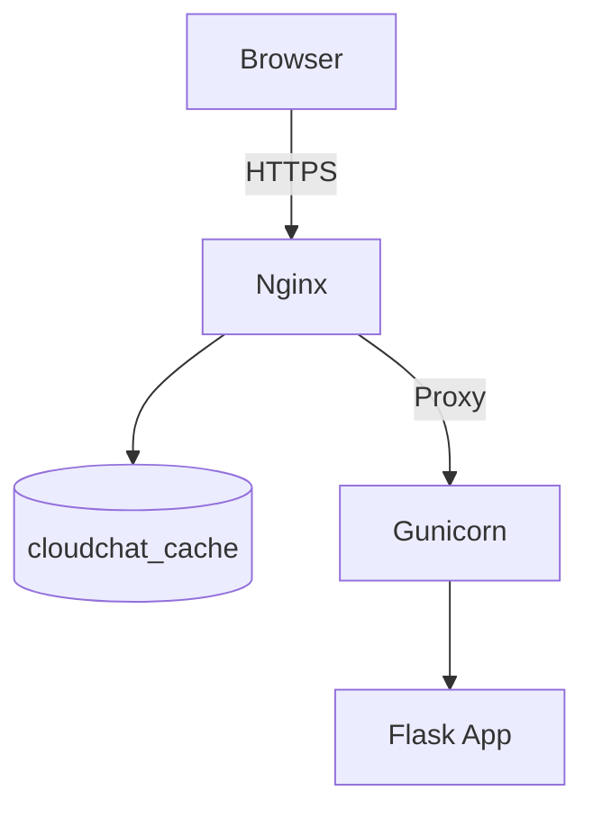

<!-- START doctoc generated TOC please keep comment here to allow auto update -->
<!-- DON'T EDIT THIS SECTION, INSTEAD RE-RUN doctoc TO UPDATE -->
**Table of Contents**  *generated with [DocToc](https://github.com/thlorenz/doctoc)*

- [Nginx Configuration for rendazhang.com](#nginx-configuration-for-rendazhangcom)
  - [简介](#%E7%AE%80%E4%BB%8B)
  - [服务器环境信息](#%E6%9C%8D%E5%8A%A1%E5%99%A8%E7%8E%AF%E5%A2%83%E4%BF%A1%E6%81%AF)
    - [架构示意图](#%E6%9E%B6%E6%9E%84%E7%A4%BA%E6%84%8F%E5%9B%BE)
    - [**后端服务**](#%E5%90%8E%E7%AB%AF%E6%9C%8D%E5%8A%A1)
    - [**前端代码**](#%E5%89%8D%E7%AB%AF%E4%BB%A3%E7%A0%81)
  - [Nginx 配置说明](#nginx-%E9%85%8D%E7%BD%AE%E8%AF%B4%E6%98%8E)
    - [关键配置功能](#%E5%85%B3%E9%94%AE%E9%85%8D%E7%BD%AE%E5%8A%9F%E8%83%BD)
  - [Nginx 服务器配置](#nginx-%E6%9C%8D%E5%8A%A1%E5%99%A8%E9%85%8D%E7%BD%AE)
    - [版本兼容表](#%E7%89%88%E6%9C%AC%E5%85%BC%E5%AE%B9%E8%A1%A8)
    - [Nginx 配置](#nginx-%E9%85%8D%E7%BD%AE)
    - [目录与用户约定](#%E7%9B%AE%E5%BD%95%E4%B8%8E%E7%94%A8%E6%88%B7%E7%BA%A6%E5%AE%9A)
    - [缓存管理](#%E7%BC%93%E5%AD%98%E7%AE%A1%E7%90%86)
    - [OOM Killer 优先级](#oom-killer-%E4%BC%98%E5%85%88%E7%BA%A7)
    - [证书自动化](#%E8%AF%81%E4%B9%A6%E8%87%AA%E5%8A%A8%E5%8C%96)
    - [故障排查](#%E6%95%85%E9%9A%9C%E6%8E%92%E6%9F%A5)
  - [相关资源](#%E7%9B%B8%E5%85%B3%E8%B5%84%E6%BA%90)
    - [项目需求](#%E9%A1%B9%E7%9B%AE%E9%9C%80%E6%B1%82)
    - [迁移指南](#%E8%BF%81%E7%A7%BB%E6%8C%87%E5%8D%97)
    - [小内存服务器指南](#%E5%B0%8F%E5%86%85%E5%AD%98%E6%9C%8D%E5%8A%A1%E5%99%A8%E6%8C%87%E5%8D%97)
  - [🤝 贡献指南](#-%E8%B4%A1%E7%8C%AE%E6%8C%87%E5%8D%97)
  - [🔐 License](#-license)
  - [📬 联系方式](#-%E8%81%94%E7%B3%BB%E6%96%B9%E5%BC%8F)

<!-- END doctoc generated TOC please keep comment here to allow auto update -->

# Nginx Configuration for rendazhang.com

* **Last Updated:** July 18, 2025, 04:00 (UTC+8)
* **作者:** 张人大（Renda Zhang）

---

## 简介

本仓库存储了 **轻量级** 网站的 Nginx 服务器配置，主要面向小内存服务器。

这些配置文件针对生产环境优化，支持 HTTPS、反向代理和安全防护措施，并具备较强的通用性，可在多种操作系统上使用。

当前示例以 **Ubuntu 24.04 LTS** 为主，关于旧版 CentOS 7 的迁移细节请参阅 📄 [迁移指南](https://github.com/RendaZhang/nginx-conf/blob/master/docs/MIGRATION_GUIDE.md#%E8%BF%81%E7%A7%BB%E6%8C%87%E5%8D%97)。

> 重量级解决方案可参考我的云原生项目：📁 [Renda Cloud LAB](https://github.com/RendaZhang/renda-cloud-lab)

---

## 服务器环境信息

- **服务器位置**: 香港
- **操作系统（示例）**: Ubuntu 24.04 LTS
- **服务器配置**:
  - 2 vCPUs
  - 1 GB RAM
  - 40 GB SSD
- **Web 服务器**: Nginx + Gunicorn(Gevent)
- **参考架构**：Web (Frontend (Astro + React + Bootstrap)) → Server (Ubuntu → Nginx → systemd → Gunicorn + Gevent → Backend (Flask APP))

### 架构示意图

Mermaid Flow 图示：



### **后端服务**

- Python Flask 部署在 Gunicorn + Gevent 上
- 具体代码请参考后端项目：📁 [Python Cloud Chat](https://github.com/RendaZhang/python-cloud-chat)

### **前端代码**

- Astro + React 架构
- 具体代码和网站页面功能描述请参考前端项目：📁 [Renda Zhang WEB](https://github.com/RendaZhang/rendazhang)

---

## Nginx 配置说明

| 文件 | 作用 |
|------|------|
| `nginx.conf` | 主配置文件，加载 `modules-enabled/` 与虚拟主机配置 |
| `fastcgi.conf` | FastCGI 相关配置 |
| `fastcgi_params` | FastCGI 参数设置 |
| `scgi_params` | SCGI 协议参数 |
| `uwsgi_params` | uWSGI 协议参数 |
| `proxy_params` | 代理通用头设置 |
| `mime.types` | MIME 类型映射 |
| `modules-enabled/` | 已启用的动态模块 |
| `sites-available/` | 可用站点配置 |
| `sites-enabled/` | 实际启用站点的软链接 |
| `snippets/` | 可复用的配置片段 |

> ⚠ **注意**: 证书目录 (`cert/`, `ssl/`) 和备份文件 (`backup/`) 等敏感 / 临时内容已通过 `.gitignore` 排除

### 关键配置功能

关键配置功能的文件：`nginx.conf`，`sites-available/rendazhang.conf`。

- **网站根目录**: `/var/www/html`
- **HTTP → HTTPS 重定向**:
  - 所有 HTTP 请求 (端口 80) 自动重定向到 HTTPS (端口 443)
- **SSL 设置**:
  - 由 Certbot 自动管理
  - 证书: `/etc/letsencrypt/live/$DomainName/fullchain.pem`
  - 私钥: `/etc/letsencrypt/live/$DomainName/privkey.pem`
  - 禁用过时的 TLSv1/TLSv1.1 协议，只允许 TLSv1.2+
- **代理与超时设置**：
  - `/cloudchat/` 路径代理到 `http://$BackendIP:$Port/`
  - `proxy_read_timeout` 设置需要跟 Gunicorn 的 `timeout` 设置对齐
- **缓存**：
  - `proxy_buffering off` 等设置以支持流式传输（注意：关闭后 `proxy_cache` 将失效）
  - 使用 `proxy_no_cache` 与 `proxy_cache_bypass` 配合，只缓存无会话的请求
  - 缓存文件在指定 `inactive` 时间内未被访问会自动清理，目录超过 `max_size` 时也会淘汰旧文件
  - 动态缓存由 `cloudchat_cache` 控制，缓存键为 `$host$request_uri`
  - 动态缓存目录是 `/var/cache/nginx`，`proxy_cache_path` 设置 `inactive=60m`、`max_size=100m`，匹配 `/cloudchat/` 接口并通过 `proxy_cache_valid 200 302 10m` 控制缓存时间；若 60 分钟未再次访问会被自动清理。
  - 缓存键由 `proxy_cache_key "$host$request_uri"` 拼接而成：
    - `$host`：主机名
    - `$request_uri`：路径
    - 缓存键示例：`wwww.rendazhang.com/cloudchat/test`
  - 静态缓存目录是 `/tmp/nginx`（备用），当前配置主要使用 `expires 30d` 控制本地静态资源缓存。
- **限速与流量控制**：
  - 每个客户端限速配置：`limit_req_zone` 定义 `flask_limit`，5 r/s
- **安全措施**:
  - `Strict-Transport-Security` 和 `Content-Security-Policy` 安全头在虚拟主机内强制启用
  - 阻止访问 `.git`, `.gitignore`, `package.json` 等敏感文件
- **自定义错误页面**:
  - `404.html`
  - `50x.html`

---

## Nginx 服务器配置

### 版本兼容表

| 组件 | 最低版本 | 当前测试版本 |
|------|---------|--------------|
| Nginx | 1.24 | 1.24.0 |
| Certbot | 2.10 | 2.10.0 |
| Gunicorn | 23 | 23.0.0 |
| Python | 3.12 | 3.12.3 |

### Nginx 配置

具体步骤可以参考文档内容：📄 [安装和配置 Nginx](https://github.com/RendaZhang/nginx-conf/blob/master/docs/MIGRATION_GUIDE.md#%E5%AE%89%E8%A3%85%E5%92%8C%E9%85%8D%E7%BD%AE-nginx)

### 目录与用户约定

**CentOS 7**

- **主目录**：`/usr/local/nginx`
- **静态站点**：`/usr/local/nginx/rendazhang`
- **缓存**：`/var/cache/nginx`
- **运行用户**：`nginx`

**Ubuntu 24**

- **主目录**：`/usr/sbin/nginx`
- **配置**：`/etc/nginx`
- **静态站点**：`/var/www/html`
- **缓存**：`/var/cache/nginx`（与 CentOS 7 相同）
- **运行用户**：`www-data`

**相关文档**

有关 Nginx 配置的目录结构和用户约定的详细操作步骤，请参考文档内容：📄 [目录与用户约定](https://github.com/RendaZhang/nginx-conf/blob/master/docs/MIGRATION_GUIDE.md#%E7%9B%AE%E5%BD%95%E4%B8%8E%E7%94%A8%E6%88%B7%E7%BA%A6%E5%AE%9A)

### 缓存管理

具体步骤可以参考文档内容：📄 [Nginx 缓存管理](https://github.com/RendaZhang/nginx-conf/blob/master/docs/MIGRATION_GUIDE.md#%E7%BC%93%E5%AD%98%E7%AE%A1%E7%90%86)

### OOM Killer 优先级

具体建议可以参考文档内容：📄 [systemd 资源策略](https://github.com/RendaZhang/nginx-conf/blob/master/docs/SMALL_SERVER_OPTIMIZATIONS.md#systemd-%E8%B5%84%E6%BA%90%E7%AD%96%E7%95%A5)

具体操作步骤可以参考文档内容：📄 [配置 OOM Killer 优先级](https://github.com/RendaZhang/nginx-conf/blob/master/docs/MIGRATION_GUIDE.md#%E9%85%8D%E7%BD%AE-oom-killer-%E4%BC%98%E5%85%88%E7%BA%A7)

### 证书自动化

证书由 Certbot 定时续期，通常无需人工干预。

具体步骤可以参考文档内容：📄 [证书自动化](https://github.com/RendaZhang/nginx-conf/blob/master/docs/MIGRATION_GUIDE.md#ssl-%E8%AF%81%E4%B9%A6%E8%AF%81%E4%B9%A6%E8%87%AA%E5%8A%A8%E5%8C%96)

### 故障排查

> **重要提示**: 每次修改配置后，请运行 `nginx -t` 验证配置有效性后再重启服务

具体步骤可以参考文档内容：📄 [检查 Nginx](https://github.com/RendaZhang/nginx-conf/blob/master/docs/MIGRATION_GUIDE.md#%E6%A3%80%E6%9F%A5-nginx)

---

## 相关资源

网站链接：🌐 [www.rendazhang.com](https://www.rendazhang.com)

前端仓库：📁 [Renda Zhang WEB Project](https://github.com/RendaZhang/rendazhang)

后端仓库：📁 [Python Cloud Chat Project](https://github.com/RendaZhang/python-cloud-chat)

云原生项目：📁 [renda-cloud-lab Project](https://github.com/RendaZhang/renda-cloud-lab)

### 项目需求

📄 [项目的需求清单](https://github.com/RendaZhang/nginx-conf/blob/master/docs/REQUIREMENTS.md#%E9%A1%B9%E7%9B%AE%E9%9C%80%E6%B1%82%E6%B8%85%E5%8D%95)

### 迁移指南

📄 [Migration Guide](https://github.com/RendaZhang/nginx-conf/blob/master/docs/MIGRATION_GUIDE.md#%E8%BF%81%E7%A7%BB%E6%8C%87%E5%8D%97)

### 小内存服务器指南

📄 [Small Server Optimizations Guide](https://github.com/RendaZhang/nginx-conf/blob/master/docs/SMALL_SERVER_OPTIMIZATIONS.md#%E9%92%88%E5%AF%B9%E5%B0%8F%E5%86%85%E5%AD%98%E6%9C%8D%E5%8A%A1%E5%99%A8%E7%9A%84%E4%BC%98%E5%8C%96%E5%92%8C%E5%A2%9E%E5%BC%BA%E5%BB%BA%E8%AE%AE)

---

## 🤝 贡献指南

- Fork & clone this repo.
- 进入虚拟环境：
   ```bash
   # 如果还没安装虚拟环境，执行命令：python -m venv venv
   source venv/bin/activate
   ```
- 安装依赖并启用 **pre-commit**:
   ```bash
   pip install pre-commit
   pre-commit install
   ```
- 在每次提交前，钩子会自动运行。
- README 和 docs 下的文档会自动更新 Doctoc 目录（若本地未安装则跳过）。
- 你也可以手动触发：
  ```bash
  pre-commit run --all-files
  ```

> ✅ 所有提交必须通过 pre-commit 检查；CI 会阻止不符合规范的 PR。

---

## 🔐 License

本项目以 **MIT License** 发布，你可以自由使用与修改。请在分发时保留原始许可证声明。

---

## 📬 联系方式

* 联系人：张人大（Renda Zhang）
* 📧 邮箱：[952402967@qq.com](mailto:952402967@qq.com)

> ⏰ **Maintainer**：@Renda — 如果本项目对你有帮助，请不要忘了点亮 ⭐️ Star 支持我们！
